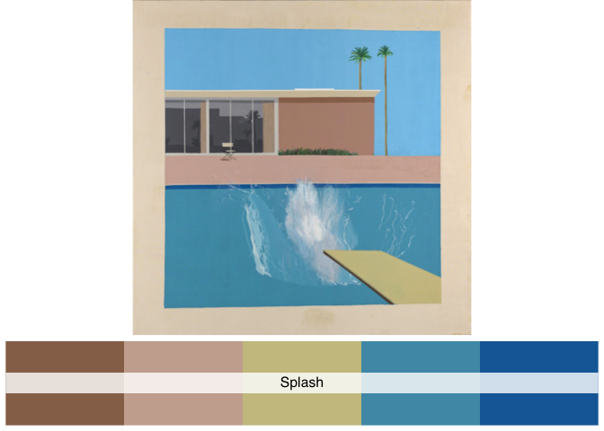
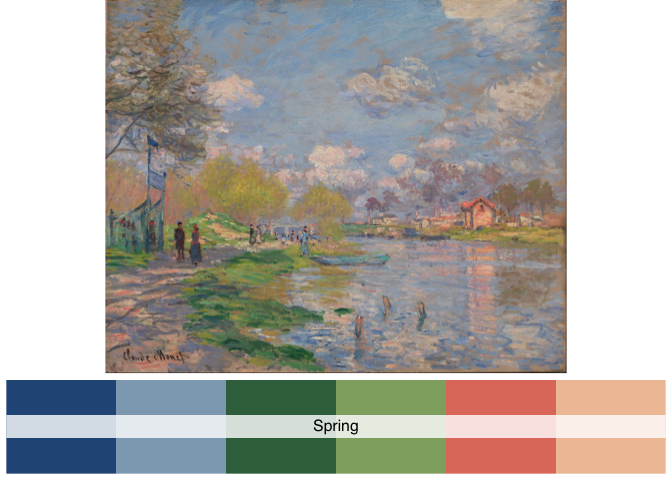

<!-- README.md is generated from README.Rmd. Please edit that file -->

# paintingr

<!-- badges: start -->
<!-- badges: end -->

The goal of paintingr is to provide a set of palettes from paintings.

Structure of the package was based on coding from the
[wesanderson](https://github.com/karthik/wesanderson) packages.

## Installation

You can install the development version from
[GitHub](https://github.com/) with:

``` r
# install.packages("devtools")
devtools::install_github("thereallda/paintingr")
```

## Usage

``` r
library(paintingr)
# display all palettes
display_all_palettes()
```


## Palettes

### Pearlgirl

Girl with a Pearl Earring - Johannes Vermeer (1665),
[Source](https://www.mauritshuis.nl/en/our-collection/artworks/670-girl-with-a-pearl-earring/)

``` r
paint_palette("Pearlgirl")
```


### Splash

A Bigger Splash - David Hockney (1967),
[Source](https://www.tate.org.uk/art/artworks/hockney-a-bigger-splash-t03254)

``` r
paint_palette("Splash")
```


### Autumn

Autumn at Oirase - Kawase Hasui (1933),
[Source](https://www.pepperholm.com/products/autumn-at-oirase)

``` r
paint_palette("Autumn")
```



### Villeneuve

Matin à Villeneuve - Henri Biva (1905),
[Source](https://en.wikipedia.org/wiki/Matin_%C3%A0_Villeneuve)

``` r
paint_palette("Villeneuve")
```


### Ophelia

Ophelia - John Everett Millais (1851-1852),
[Source](https://www.tate.org.uk/art/artworks/millais-ophelia-n01506)

``` r
paint_palette("Ophelia")
```


### Kitchen

Kitchen (Detail 2) - Liza Lou (1991–1996),
[Source](https://whitney.org/collection/works/34855)

``` r
paint_palette("Kitchen")
```


### Spring

SPRING BY THE SEINE - Claude Monet (1875),
[Source](https://www.mcgawgraphics.com/products/claude-monet-spring-by-the-seine-1875)

``` r
paint_palette("Spring")
```


### Starrynight

Starry Night Over the Rhône - Vincent van Gogh (1888),
[Source](https://en.wikipedia.org/wiki/Starry_Night_Over_the_Rh%C3%B4ne)

``` r
paint_palette("Starrynight")
```



### Strawberries

Strawberries - Édouard Manet (1882),
[Source](https://www.metmuseum.org/art/collection/search/436963)

``` r
paint_palette("Strawberries")
```


### Seascape

Seascape at Saintes-Maries - Vincent van Gogh (1888),
[Source](https://en.wikipedia.org/wiki/Saintes-Maries_(Van_Gogh_series))

``` r
paint_palette("Seascape")
```


### Twilight

Twilight, Venice - Claude Monet (1908),
[Source](https://commons.wikimedia.org/wiki/File:Claude_Monet_-_Twilight,_Venice.jpg)

``` r
paint_palette("Twilight")
```


## Examples

`ggplot2`-based examples

### Heatmap

``` r
library(ggplot2)
# Dummy data
x <- LETTERS[1:20]
y <- paste0("var", seq(1,20))
data <- expand.grid(X=x, Y=y)
data$Z <- seq(1,20)+runif(400, 0, 5)

# Heatmap 
pal <- paint_palette("Autumn", n=100, type="continuous")
ggplot(data, aes(X, Y, fill= Z)) + 
  geom_tile() + 
  scale_fill_gradientn(colours = pal) + 
  scale_x_discrete(expand = c(0, 0)) +
  scale_y_discrete(expand = c(0, 0)) + 
  coord_equal() 
```


### Boxplot

``` r
# use iris data from `ggplot2` for demonstration
data(iris)

ggplot(iris, aes(Species, Sepal.Length)) +
  geom_boxplot(aes(fill = Species)) +
  theme_classic() +
  theme(legend.position = "top") +
  scale_fill_manual(values = paint_palette("Villeneuve"))
```


### Scatter

``` r
# Scatter
ggplot(iris, aes(Sepal.Length, Sepal.Width)) +
  geom_point(aes(color = Species)) +
  theme_classic() +
  theme(legend.position = "top") +
  scale_color_manual(values = paint_palette("Kitchen"))
```


### Violin plot

``` r
data(mpg)
# violin plot with 7 colors, Spring palette only have six colors add one more
ggplot(mpg, aes(x=class, y=hwy, fill=class)) + 
  geom_violin() +
  theme_classic() +
  scale_fill_manual(values = c(paint_palette("Spring", n=6), "black"))
```


