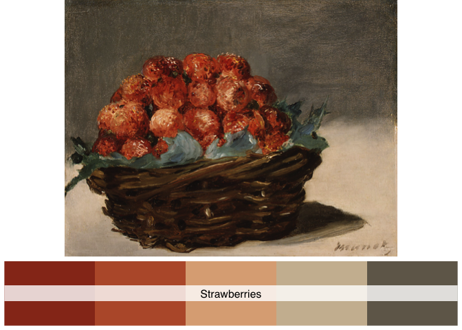
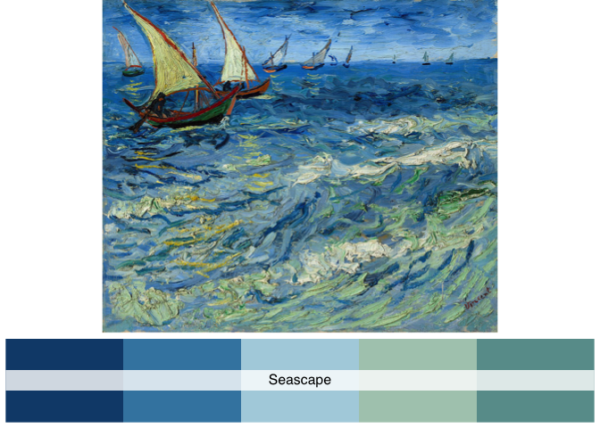
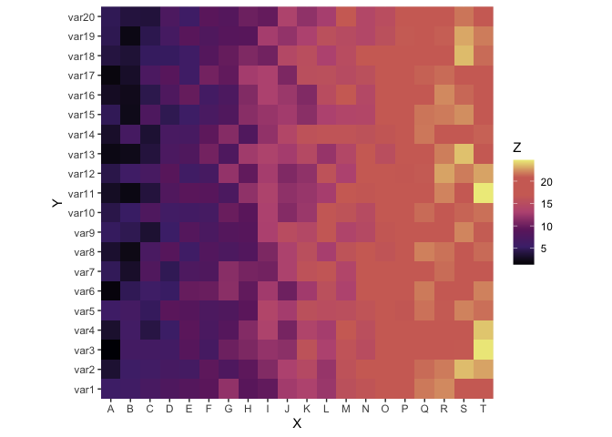
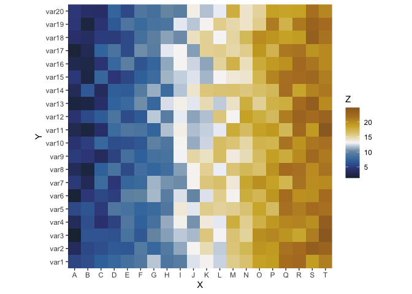

<!-- README.md is generated from README.Rmd. Please edit that file -->

# paintingr

<!-- badges: start -->
<!-- badges: end -->

> “The greatest value of a picture is when it forces us to notice what we never expected to see.” - John Tukey

Color is one of the most important attributes of a figure. Dedicated choice of color can help us deliver our idea more vividly.

------------------------------------------------------------------------

The goal of `paintingr` is to provide a set of palettes from paintings.

Structure of the package was based on coding from the [wesanderson](https://github.com/karthik/wesanderson) packages.

## Installation

You can install the `paintingr` with:

    install.packages('paintingr')

Or the development version from [GitHub](https://github.com/) with:

    # install.packages("devtools")
    devtools::install_github("thereallda/paintingr")

## Usage

    library(paintingr)
    # display all palettes
    display_all_palettes()

## Palettes

### Pearlgirl

Girl with a Pearl Earring - Johannes Vermeer (1665), [Source](https://www.mauritshuis.nl/en/our-collection/artworks/670-girl-with-a-pearl-earring/)

    paint_palette("Pearlgirl")

### Splash

A Bigger Splash - David Hockney (1967), [Source](https://www.tate.org.uk/art/artworks/hockney-a-bigger-splash-t03254)

    paint_palette("Splash")

### Autumn

Autumn at Oirase - Kawase Hasui (1933), [Source](https://www.pepperholm.com/products/autumn-at-oirase)

    paint_palette("Autumn")

### Villeneuve

Matin à Villeneuve - Henri Biva (1905), [Source](https://en.wikipedia.org/wiki/Matin_%C3%A0_Villeneuve)

    paint_palette("Villeneuve")

### Ophelia

Ophelia - John Everett Millais (1851-1852), [Source](https://www.tate.org.uk/art/artworks/millais-ophelia-n01506)

    paint_palette("Ophelia")

### Kitchen

Kitchen (Detail 2) - Liza Lou (1991–1996), [Source](https://whitney.org/collection/works/34855)

    paint_palette("Kitchen")

### Spring

SPRING BY THE SEINE - Claude Monet (1875), [Source](https://www.mcgawgraphics.com/products/claude-monet-spring-by-the-seine-1875)

    paint_palette("Spring")

### Strawberries

Strawberries - Édouard Manet (1882), [Source](https://www.metmuseum.org/art/collection/search/436963)

    paint_palette("Strawberries")

### Seascape

Seascape at Saintes-Maries - Vincent van Gogh (1888), [Source](https://en.wikipedia.org/wiki/Saintes-Maries_(Van_Gogh_series))

    paint_palette("Seascape")

### Twilight

Twilight, Venice - Claude Monet (1908), [Source](https://commons.wikimedia.org/wiki/File:Claude_Monet_-_Twilight,_Venice.jpg)

    paint_palette("Twilight")

### Abstract

Abstract Composition - Jessica Dismorr (1915), [Source](https://www.tate.org.uk/art/artworks/dismorr-abstract-composition-t01084)

    paint_palette("Abstract")

### Vesuivus

Vesuvius in Eruption - Joseph Wright (1776-1780), [Source](https://www.bl.uk/collection-items/vesuvius-in-eruption)

    paint_palette("Vesuvius")

### Sunset

Sunset at Grace, Orange and Violet Sky - Felix Edouard Vallotton (1918), [Source](https://arthur.io/art/felix-edouard-vallotton/sunset-at-grace-orange-and-violet-sky)

    paint_palette("Sunset")

### Caront

Caront - Guim Tió Zarraluki (2019), [Source](https://www.instagram.com/guimtio/p/CqpSpcVNjNA/)

    paint_palette("Caront")

### Starrynight

*The Starry Night* - Vincent van Gogh (1889), [Source](https://www.moma.org/collection/works/79802)

    paint_palette("Starrynight")

## Examples

`ggplot2`-based examples

### Heatmap

Use `type="continuous"` to automatically interpolate between colors if you want more colors than the palette can offer (n &gt; 5/6).

    library(ggplot2)
    # Dummy data
    x <- LETTERS[1:20]
    y <- paste0("var", seq(1,20))
    data <- expand.grid(X=x, Y=y)
    data$Z <- seq(1,20)+runif(400, 0, 5)

    # Heatmap 
    pal <- paint_palette("Sunset", n=100, type="continuous")
    ggplot(data, aes(X, Y, fill= Z)) + 
      geom_tile() + 
      scale_fill_gradientn(colours = pal) + 
      scale_x_discrete(expand = c(0, 0)) +
      scale_y_discrete(expand = c(0, 0)) + 
      coord_equal() 

    # Heatmap with palette of "Starrynight" 
    ggplot(data, aes(X, Y, fill= Z)) + 
      geom_tile() + 
      scale_fill_gradientn(colours = paint_palette("Starrynight", n=100, type="continuous")) + 
      scale_x_discrete(expand = c(0, 0)) +
      scale_y_discrete(expand = c(0, 0)) + 
      coord_equal() 

    # Heatmap with palette of "Vesuvius" 
    ggplot(data, aes(X, Y, fill= Z)) + 
      geom_tile() + 
      scale_fill_gradientn(colours = paint_palette("Vesuvius", n=100, type="continuous")) + 
      scale_x_discrete(expand = c(0, 0)) +
      scale_y_discrete(expand = c(0, 0)) + 
      coord_equal() 

### Boxplot

    # use iris data from `ggplot2` for demonstration
    data(iris)

    ggplot(iris, aes(Species, Sepal.Length)) +
      geom_boxplot(aes(fill = Species)) +
      theme_classic() +
      theme(legend.position = "top") +
      scale_fill_manual(values = paint_palette("Pearlgirl"))

### Scatter

    # Scatter
    ggplot(iris, aes(Sepal.Length, Sepal.Width)) +
      geom_point(aes(color = Species)) +
      theme_classic() +
      theme(legend.position = "top") +
      scale_color_manual(values = paint_palette("Caront"))

### Violin plot

    data(mpg)
    # violin plot with 7 colors, Spring palette only have six colors add one more
    ggplot(mpg, aes(x=class, y=hwy, fill=class)) + 
      geom_violin() +
      theme_classic() +
      scale_fill_manual(values = c(paint_palette("Twilight", type = "continuous", n=7)))

### Barplot

    ggplot(mpg, aes(x = class, fill = drv)) + 
      geom_bar() +
      theme_classic() +
      scale_fill_manual(values = paint_palette("Seascape"))

